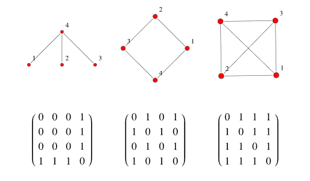

- Also called connection matrix.
- It's a matrix with the following characteristic:
    - rows and columns are labeled by [[Graph Vertices]]
    - with a 1 or 0 in position $(v_i, v_j)$ according to whether they're adjacent or not
- 