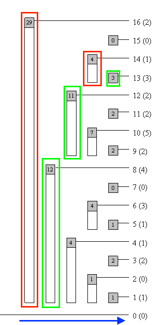

- 
- Implementation
    - init the tree
        - Index 0 should not be used and acts as the root of the [[Tree]]:
        - ```python
          from math import log2, trunc
          
          
          class MKAverage:
          	def __init__(self, m: int, k: int):
                self.bit = [0] * ((1 << 17) + 1) # use power of 2 for O(log n) find_kth_smallest
          ```
    - update freq at i
        - ```python
          def update(self, i: int, diff: int) -> None:
                 while i < len(self.bit):
                     self.bit[i] += diff
                     i += i & -i
          ```
    - range sum query
        - ```python
          def query(self, i: int, j: int) -> int:
                 _sum = 0
                 while j > i:
                     _sum_ += self.bit[j]
                     j -= j & -j
                 while i > j:
                     _sum -= self.bit[i]
                     i -= i & -i
                 
                 return _sum
          ```
    - find the pos with prefix sum: k
        - ```python
          def find_prefix_sum(self, k: int) -> int:
                 _sum, pos, n = 0, 0, len(self.bit)
                 for i in reversed(range(trunc(log2(n)) + 1)):
                     idx = pos + (1 << i)
                     if idx < n and cnt + self.bit[idx] < k:
                         cnt += self.bit[idx]
                         pos = idx
                     
                 return pos + 1
          ```
- Complexity
    - [[Time Complexity]]: $O(log(N))$ for all operations
    - [[Space Complexity]]: $O(N)$
- ---
- Alternative
    - [[Segment Tree]]
        - they're both used for range querying and updating. But BIT is more memory efficient.
- ---
- References
    - [Binary Indexed Tree](https://www.topcoder.com/thrive/articles/Binary%20Indexed%20Trees)
    - [Prefix Sum Search in O(log (N))](https://codeforces.com/blog/entry/61364)