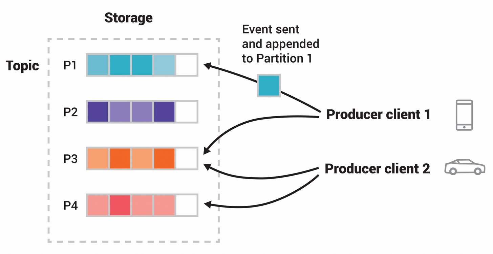

- Event
    - Also known as `Message`
    - Concist of
        - Key
        - Value
        - Timestamp
        - Metadata (Optional)
- Producers
    - Clients that publish the events.
    - Producers never wait for consumers.
- Consumers
    - Clients who subscribe to the events.
- Topic
    - Events are organized and durably stored in topics.
    - Corresponds to multiple producers and consumers.
    - Every topic can be <mark style='background-color:#bbfabb'>replicated</mark>.
- Partition
    - Topics are partitioned
        - {:height 315, :width 593}
        - A topic is spread over a number of "buckets" located on different Kafka brokers.
        - Events with the same event key are written to the same partition.
          background-color:: pink