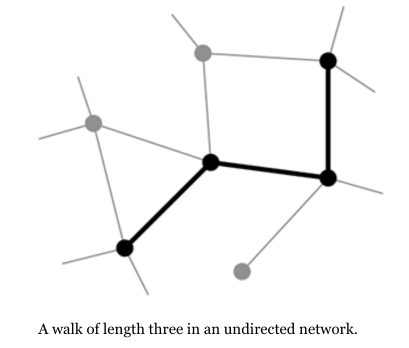

- A *walk* in a [[Graph]] is any sequence of nodes such that every consecutive pair of nodes in the sequence is connected by an edge.
    - It is any route that runs from node to node along the edges.
    - Walks can be defined for both [[Directed Graph]] and [[Undirected Graph]].
        - In a directed graph, each edge traversed by a walk must be traversed in the direction of that edge.
        - In an undirected graph edges can be traversed in either direction.
- A walk can intersect itself
    - revisiting a node it has visited before
    - or running along an edge or set of edges more than once.
- Walks that do not intersect themselves are called [[Path]] or self-avoiding walks.
- Walk Length
    - The number of edges traversed along the walk.
    - Hops the walk makes from node to adjacent node.
    - A given edge can be traversed/counted more than once.
    - {:height 240, :width 269}
- Number of walks with arbitrary length $r$. between `i` and `j`[^1]
    - $N^{(r)}_{ij}=[A^r]_{ij}$
    - `A` is the [[Adjacency Matrix]] of a [[Graph]].
- Number of loops of length
    - The number of walk of length `r` that starts and ends at the same node `i` is $[A^r]_{ii}$.
    - The total number $L_r$ of loops of length `r` is the sum of this quantity over all possible starting points `i`:
        - $L_r=\sum_{i=1}^{N}[A^r]_{ii}=Tr A^r$
    - Loops that consist of same nodes but with different sequence are counted separately.[^2]
        - 1→2→3→1 and 2→3→1→2 are distinct.
        - 1→2→3→1 and 1→3→2→1 are distinct.
- Reference
    - Newman, M. E. J. (2018). 6.11 Walks and paths. In *Networks* (2nd ed., pp. 131 - 132). essay, Oxford University Press.
- ---
- [^1]: For a more rigorous proof we can use induction. If there are $N^{(r−1)}_{ik}$ walks of length $r−1$ from $k$ to $i$, then by arguments similar to those above there are $N_{i j}^{(r)}=\sum_{k} N_{i k}^{(r-1)} A_{k j}$ walks of length $r$ from $j$ to $i$, or in matrix notation $\mathbf{N}^{(r)}=\mathbf{N}^{(r-1)} \mathbf{A}$, where $N^{(r)}$ is the matrix with elements $N^{(r)}_{ij}$. This implies that if $\mathbf{N}^{(r-1)}=\mathbf{A}^{r-1}$ then $N^{(r)}=A^r$. Starting from the base case $N^{(1)}=A$ we then have $N^{(r)}=A^r$ for all $r$ by induction, and taking the $ij$th element of both sides gives the equation
- [^2]: If we wish to count each loop only once, we should roughly speaking divide by *r*, but this does not allow for walks that have symmetries under a change of starting points, such as walks that consist of the same sub-loop traversed repeatedly. Counting such symmetric walks properly is a complex problem that can be solved exactly in only a few cases.