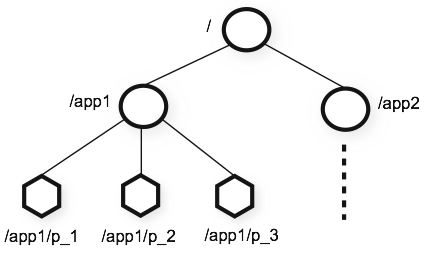

- Hierarchical Namespace
    - 
    - [[ZNode]] Tree Structure.
        - Similar to file system structure.
            - But each [[ZNode]] can have <mark style="background: #FFB8EBA6;">data</mark> associated with it as well as <mark style="background: #FFB8EBA6;">children</mark>.
        - Paths to nodes are always expressed as canonical, absolute, slash-separated paths
    - Store in memory.
- ZooKeeper tracks time in multiple ways:
  id:: 644b964d-c3a3-47e4-ab10-c4d7e9279d3c
    - [[zxid]]
    - Version numbers:
      id:: 6059356b-056d-4e65-b0f5-92c908cf48da
        - Each change to a node will cause an increase to one of the version number of the node.
            - version: number of change to the data of the node
            - cversion: number of changes to the children of the node
            - aversion: number of changes to the ACL of the node
    - Ticks
        - A basic unit of time used to measure the passage of time within the ZooKeeper system.
            - ((8a39d4d2-403f-4d5c-aac9-443fb3c60b3c))
            - [TTL](((ba52b71f-84d0-49ab-86ca-164ff2695b3c)))
    - Real time:
        - ctime
        - mtime
- ZooKeeper Stat Structure  is reflected by [ZNode stat strcuture](((b2870e0b-d7fd-4be5-b8ba-d451d506e20e)))