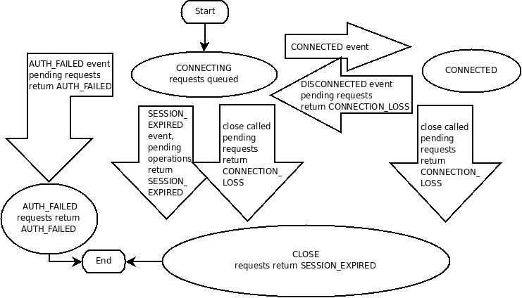

- 
- Clients establish a session with a single ZooKeeper server via <mark style="background: #BBFABBA6;">TCP persistent connection</mark>.
- The client sends request, gets responses, gets [watch events]([[ZooKeeper/Watch]]) through the connection.
- Session health is detected by [[heartbeat]].
  id:: c4610b5d-51d1-4847-ba1b-9fb856826d80
    - If no [[heartbeat]] received from the client within the session timeout, the session is expired/ended.
- ZooKeeper create a session ID and password and assign them to the client.
    - To reconnect to another server during the session, session ID and password are required.
- Session timeout
  id:: 8a39d4d2-403f-4d5c-aac9-443fb3c60b3c
    - If the TCP connection breaks, the client will connect to a different server as long as the session doesn't timeout.
        - The server list is provided when clients create the session.
            - `host:port`
            - `host:port/path/to/root`
                - *Added in v3.2.0*
                - supports multi-tenant environments
    - Session time out is configured by `sessionTimeout`  .
        - `2 * tick <= session timeout <= 20 * tick`
- Local Session
    - *Added in v3.5.0*
    - Why local session:
        - the creation and closing of global session are costly
            - because it needs [quorum]([[ZooKeeper/Quorum]]) confirmations
    - Once the session is lost, users cannot re-establish it using the session-id/password.
        - Connection lost doesn't means the session lost.
        - If the connection can be reestablished with the same zk server before the session timeout then the client can continue.
    - Session info in only maintained on the ZooKeeper server that it's connected to.
        - The leader is not aware of the creation of such a session and there is no state written to disk.
        - Session health is also maintained by the server.
    - Ephemeral node creation need to upgrade the local session to global session
        - If don't update to the global session, then it will cause data inconsistency between different nodes.
        - Write operation in ZooKeeper should be a [quorum]([[ZooKeeper/Quorum]]) operaion.