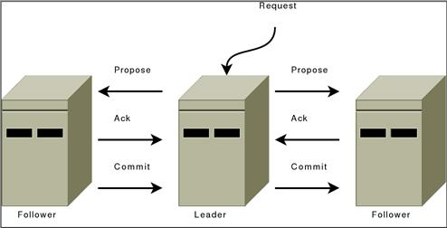

- 
- Only the leader accepts the write requests and sync to the followers.
    - **Similar** to classic [[2PC]]
    - The ACK and commit need a [[quorum]] of followers' vote.
- Follower forwards the write requests to the leader.
- All communication channels are [[FIFO]], so everything is done in order.
- Phases:
    - Phase 1: Propose
        - Leader sends a new proposal to followers using the same order
            - Leader generates and attaches a unique [[zxid]] to the proposal
            - Leader writes the proposal into the disk log.
              2. Followers receive the proposal
            - Followers process messages in the order they are received.
                - Due to [[FIFO]]
            - Follower writes the proposal into the disk log.
    - Phase 2: Commit
        - Leader receives the proposal ACK from a [[quorum]] of followers in order
            - Leader writes the data into memory as [[Zookeeper/ZNode]].
            - Sends the commit to follower in order.
              1. Followers receive the commit
            - Followers write the data into memory as [[Zookeeper/ZNode]].