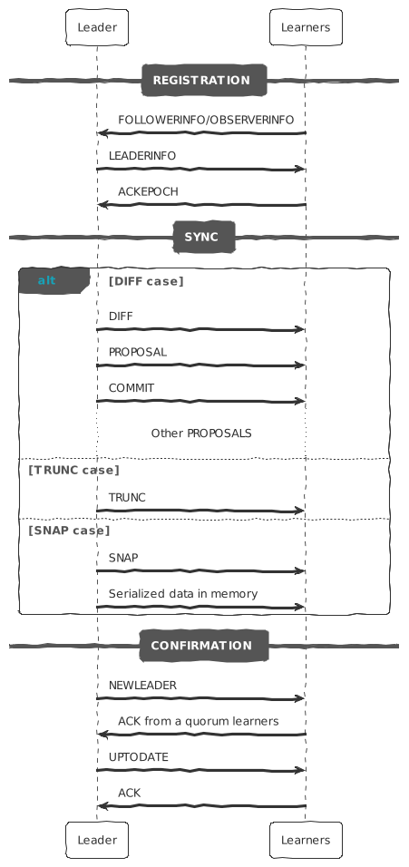

- Introduction
    - Sequence of events during the leader activation:
        - Election
        - Registration
        - Sync up
        - Confirmation
- Election
  id:: ac1c1f9d-71bd-4966-b7c0-7d4b4c337806
    - The ZooKeeper messaging doesn't care about the exact method of electing a leader as long as the following holds:
        - The leader has seen the highest [[zxid]] of all the followers
            - Why elect the one that has seen the highest [[zxid]]?
              id:: 63de444b-7210-4066-a991-5c875d82685e
                - Think about this scenario:
                  Assume we have 5 machines: `A, B, C, D, E`
                    - A is the leader
                    - The others are all followers
                - A new proposal `u` arrives at the leader `A`, and it's acked only by `B, C, D`.
                - The leader continues to the commit phase.
                    - It commits and tells the client that the data has been saved.
                    - But it exits before sending the commits to followers.
                - Since the leader is down, so we need to do the new leader election.
                - If we don't have the highest [[zxid]] constrain
                    - E` is possible to be elected as the leader.
                    - However, `E` hasn't seen the proposal `u`, so it will tell the followers discard it
                    - The data of proposal `u` is lost.
        - A [[quorum]] of servers have committed to following the leader.
- Sync up
    - When a leader is elected, it will start to sync with the followers:
    - Send any proposals that the follower are missing
        - Send a full snapshot of the state to the follower if it's missing too many proposals.
    - Edge Cases
        - If a follower has a proposal `u` that is not seen by the leader.
            - **Old Leader failed before sending proposal**.
              id:: 18d3854a-f503-4bf1-a828-81b63dd83867
            - It's a new arrived follower after the leader election. Otherwise, the follower will be elected as the new leader.
                - Possible to be the old leader that received the proposal `u` but exited before sending the proposal.
                - It recovered after the new leader election.
            - The new leader will tell the follower discard the proposal `u`.
        - A proposal that is acked by a [[quorum]] of old followers, but not yet committed.
            - **Old Leader failed before sending commit**
            - The new leader needs to resend the commit requests to followers.
            - ((63de444b-7210-4066-a991-5c875d82685e))
- Algorithm
    - Leader may apply different method to different followers:
        - DIFF
        - TRUNC
        - TRUNC + DIFF
        - SNAP
    - Leader maintains a write request queue <mark style="background: #ABF7F7A6;">in memory</mark>.
        - Default size is 500 which is configured by `zookeeper.commitLogCount`
        - We know the oldest and newest [[zxid]] in the queue:
            - `minZxid`
            - `maxZxid`
    - Each server maintains proposals log <mark style="background: #ABF7F7A6;">in non-volatile storage</mark>.
    - DIFF
        - Incremental replication
        - Wrap the missing write requests to a series of proposal and commit.
        - Recover from Write Queue
            - Condition
                - Follower's largest [[zxid]] is between `minZxid` and `maxZxid`
        - Recover from Proposal Log
            - Condition:
                - Follower's largest [[zxid]] is smaller than `minZxid`
                - `zookeeper.snapshotSizeFactor` is larger than 0
                    - Default is 0.33, means 33%
                    - Assume it's 33% for the following condition
                - If the size of log to sync is smaller than 33% of snapshot file.
    - TRUNC
        - Leader will tell follower to discard a proposal.
        - Condition:
            - Follower's largest [[zxid]] is larger then `maxZxid`
    - TRUNC + DIFF
        - Leader will tell follower to discard the proposal and do the DIFF.
        - To solve the edge case: ((18d3854a-f503-4bf1-a828-81b63dd83867))
    - SNAP
        - Leader takes a snapshot of the current data in memory and send it to followers.
        - Condition:
            - [[zxid]] is smaller than `minZxid`.
- Confirmation
    - Process
        - A follower will ACK the NEW_LEADER proposal after it has synced with the leader.
        - A follower will only ACK a NEW_LEADER proposal with a given zxid from a single server.
        - A new leader will COMMIT the NEW_LEADER proposal when a [[quorum]] of followers has ACKed it.
        - A follower will commit any state it received from the leader when the NEW_LEADER proposal is COMMIT.
        - A new leader will not accept new proposals until the NEW_LEADER proposal has been COMMITTED.
- Failure
    - If the process terminates erroneously, we don't have a problem
    - Since the NEW_LEADER proposal will not be committed.
    - When this happens, the leader and any remaining followers will timeout and go back to leader election.
- Sequences
    - {:height 776, :width 362}